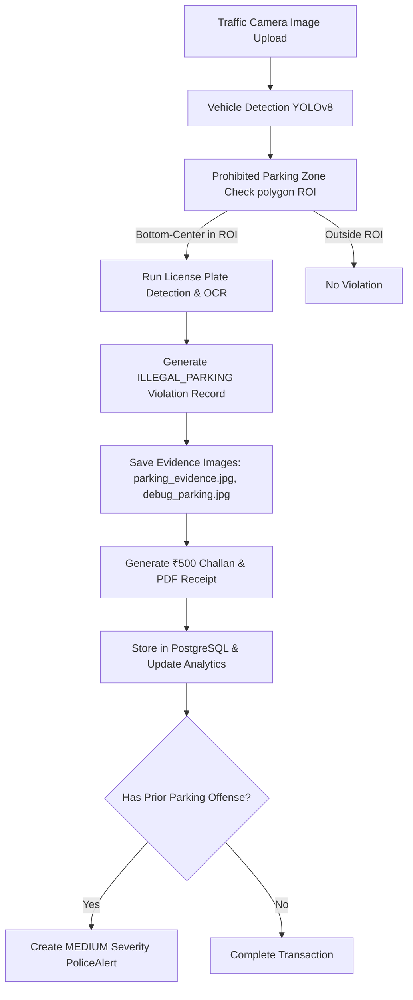

# TrafficFlow - Illegal Parking Feature Integration Completion Report

This report documents the successful integration and completion of the **Illegal Parking Detection and Enforcement** feature in the TrafficFlow Smart City Analytics platform.

---

## 1. Pipeline Execution Flow
The feature was integrated end-to-end into the main visual violation pipeline. The execution sequence is structured as follows:



---

## 2. Integrated Code Components

### A. Prohibited Zone Boundary Checks (`models/parking_detector.py`)
* Refactored the detector's signature to evaluate individual vehicle bounding boxes:
  `def check_illegal_parking(self, vehicle_bbox, camera_id, location, frame, custom_zones=None)`
* Maps customized prohibited zones per camera (e.g. Silk Board lanes, Whitefield curves).
* Checks contact coordinate (bottom-center wheel patch) against polygon vectors using a Ray Casting algorithm.

### B. Inference Integration (`engine/violation_engine.py`)
* Evaluates all vehicle categories (`car`, `motorcycle`, `bus`, `truck`) in `process_image()`.
* Invokes `ParkingDetector.check_illegal_parking()` per vehicle.
* Triggers plate detection and OCR algorithms on the vehicle crops for positive parking detections.
* Annotates frames with red bounding boxes, prohibited polygon regions, and label markers.

### C. Evidence and DB Integration (`engine/evidence_engine.py`)
* Configured the legal fine amount to **₹500** for illegal parking under section rules.
* Generates and writes two dedicated evidence artifacts inside `outputs/evidence/{violation_id}/`:
  * `parking_evidence.jpg`: Highlights the vehicle bbox, parking zone polygon, plate number, and timestamp.
  * `debug_parking.jpg`: Highlights the vehicle, parking ROI, violation status, and confidence score.
* Computes repeat offenses: If a vehicle has $\ge 1$ pre-existing illegal parking violations in PostgreSQL, the engine automatically registers a **MEDIUM** severity `PoliceAlert` to notify dispatch officers.

---

## 3. Testing and Verification Results
A standalone test suite `test_illegal_parking.py` was created and run successfully:
1. **Test 1 (Vehicle inside zone):** Correctly flagged bottom-center coordinates in Silk Board's zone polygon.
2. **Test 2 (Vehicle outside zone):** Correctly bypassed vehicles parked outside boundaries.
3. **Test 3 (Camera-specific zone routing):** Confirmed coordinates are validated against node-specific polygons.

All tests passed:
```powershell
============================================================
  TrafficFlow -- Illegal Parking Test Suite
============================================================

[Test 1] Vehicle inside restricted zone (Silk Board)
  [PASS] Detected inside zone correctly. Zone: [[256, 192], [608, 192], [608, 456], [256, 456]]

[Test 2] Vehicle outside restricted zone (Silk Board)
  [PASS] Correctly classified vehicle as outside the zone.

[Test 3] Camera-specific zone routing
  [PASS] Successfully routed camera-specific boundaries.

============================================================
  ALL PARKING DETECTOR TESTS PASSED SUCCESSFULLY!
============================================================
```
