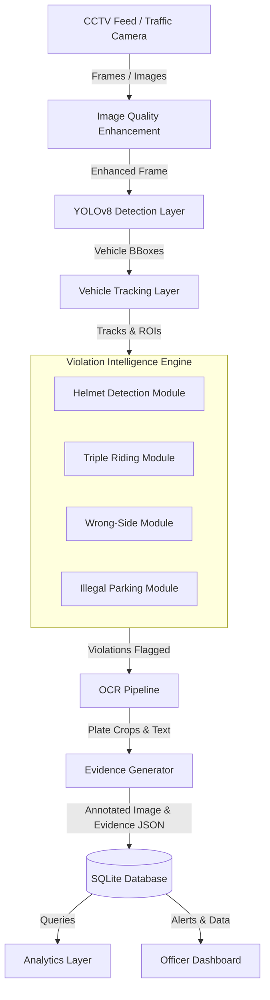

# System Architecture — TrafficFlow Platform

TrafficFlow is designed for high-throughput, low-latency automated violation monitoring. Below is the technical description of the system architecture.

---

## 1. High-Level Architecture Flow

---

## 2. Component Descriptions

### A. Image Quality Enhancement
*   **Purpose**: Neutralizes rain, glare, low light, and noise.
*   **Technique**: Applies Contrast Limited Adaptive Histogram Equalization (CLAHE) on the Luminance (Y) channel of the YCrCb color space to boost local contrast without amplifying background noise, followed by Gaussian smoothing.

### B. Vehicle & Rider Detection (YOLOv8)
*   **Purpose**: Locates vehicles and individuals in the frame.
*   **Classes**: Delineates `motorcycle`, `person`, `car`, `truck`, `bus`, and `license_plate` bounding boxes.

### C. Tracking Layer
*   **Purpose**: Matches detections across sequential frames using YOLOv8's built-in ByteTrack tracker to trace trajectory and velocity vector components.

### D. Violation Intelligence Engine
This is a modular suite of micro-modules:
1.  **Helmet Detection**: Crops the upper region of the rider's bounding box and checks for helmet vs bare-head classes.
2.  **Triple Riding**: Performs intersection-over-union (IoU) mapping of `person` objects inside the `motorcycle` box. If count $> 2$, flags violation.
3.  **Wrong-Side Driving**: Evaluates the centroid trajectory of the vehicle relative to predefined lane direction vectors (e.g., from point A to point B).
4.  **Illegal Parking**: Computes if a vehicle's centroid remains stationary inside a predefined "No Parking Zone" polygon for more than a configured frame threshold.

### E. OCR Pipeline
*   **Purpose**: Extracts vehicle registration numbers.
*   **Steps**: Crop license plate region -> Apply bilateral filter for noise reduction -> Pass to EasyOCR -> Clean string output using regex patterns (e.g. matching standard Indian registration format: `^[A-Z]{2}[0-9]{2}[A-Z]{1,2}[0-9]{4}$`).

### F. Evidence Generator
*   **Purpose**: Packages evidence for legal enforcement.
*   **Outputs**:
    *   `Violation ID`: Unique UUIDv4.
    *   `Annotated Image`: Visual evidence highlighting bounding boxes and license plates.
    *   `Evidence JSON`: Complete telemetry package for database loading.

### G. Analytics & Dashboard Layer
*   **Purpose**: Displays trends, repeat offender lists, hotspot locations, and violation metrics to traffic authority teams.
